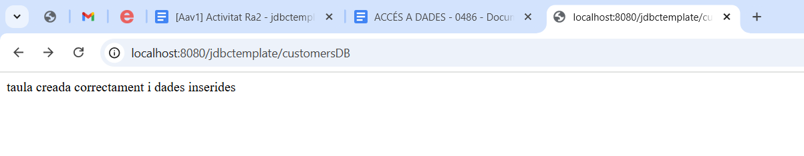
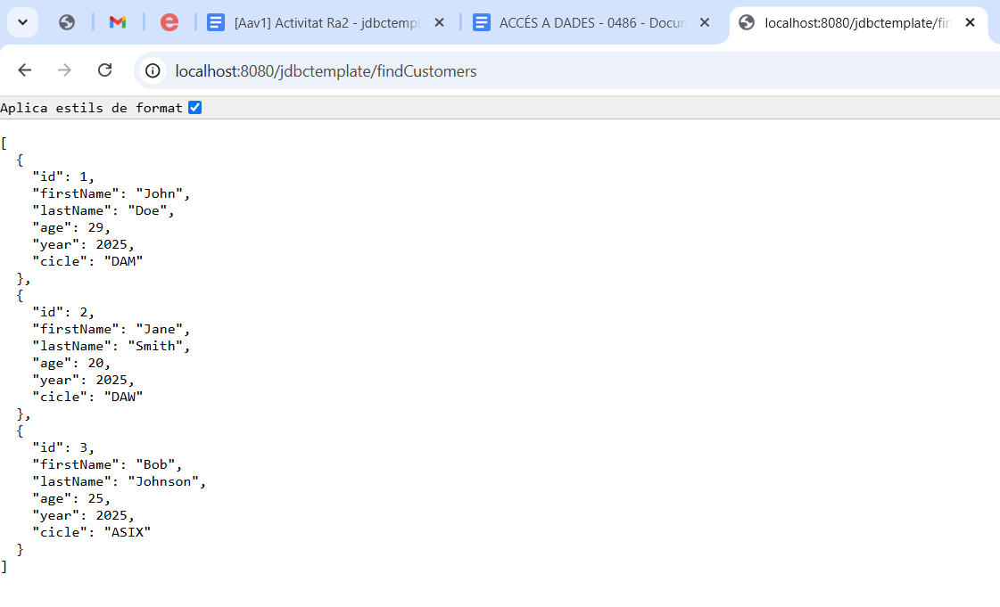
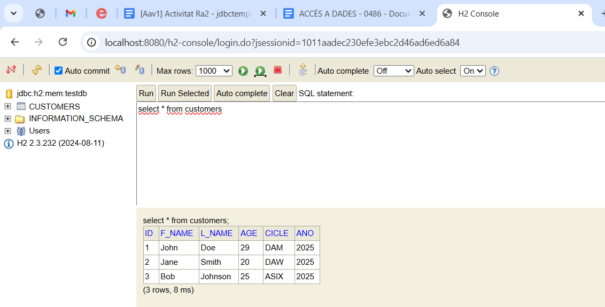

# Activitat 1 RA2
#### Set Catalán Ribolleda

Aquest endpoint ens serveix per crear la base de dades i afegir alguns inserts de prova

I aquest ens serveix per veure totes les dades de la base de dades

També podem accedir a la consola de h2 per fer les nostres operacions a la base de dades personalment
